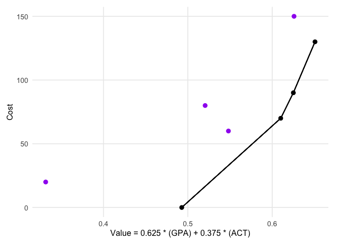
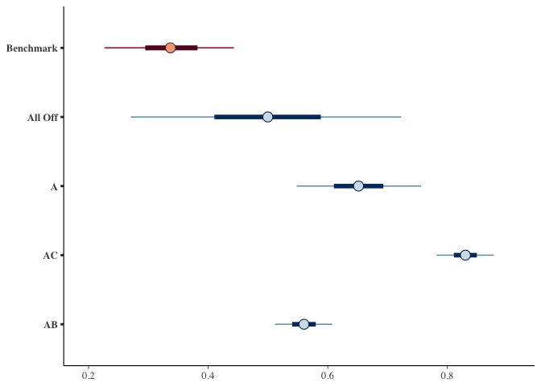
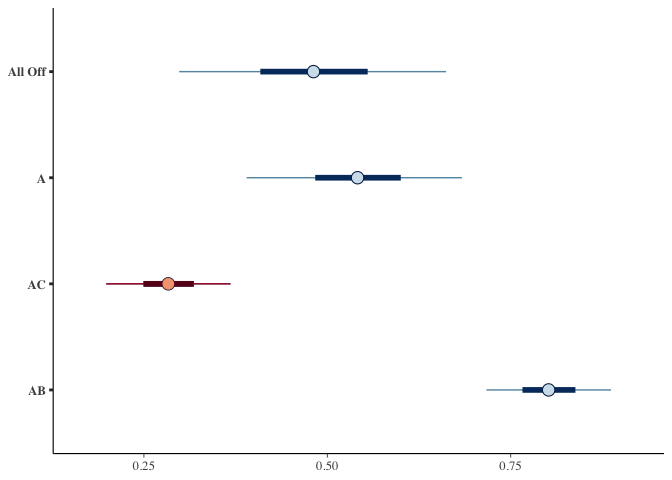
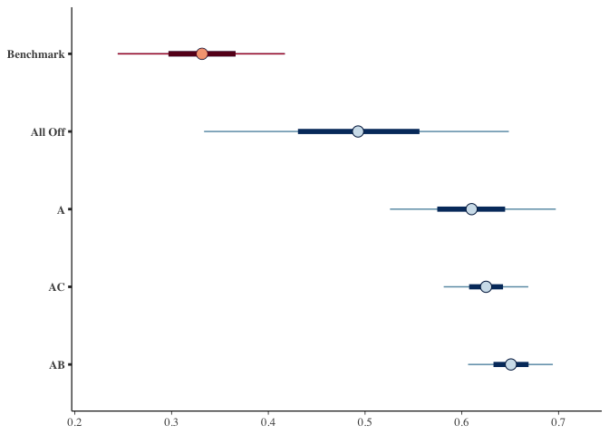

<!-- README.md is generated from README.Rmd. Please edit that file -->

# DAIVEtools

<!-- badges: start -->

<!-- badges: end -->

The goal of DAIVEtools is to support Decision Analysis for Intervention
Value Efficiency (DAIVE) by providing R functions to easily format data,
visualize results, and identify frontiers of efficiency for factorial
optimization trial data.

## Installation

You can install the development version of DAIVEtools from
[GitHub](https://github.com/) with:

``` r
# install.packages("pak")
pak::pak("setheaton/DAIVEtools")
```

## Example

This is a basic example which shows how DAIVEtools can format posterior
draws data into a table of expected value:

``` r
library(DAIVEtools)

## combine draws dataframes into a list object
draws <- list(gpaDraws, actDraws)

## define vectors of components and outcomes labels
components <- c("A", "B", "C")
outcomes <- c("GPA", "ACT")

## generate a daive_grid object that contains expected value
g <- DAIVEtools::daive_grid(draws, outcomes, components, costs=c(70, 60, 20))
get_table(g)
#>    A  B  C   names        GPA      ACT GPA.scale ACT.scale cost value_function
#> 1 -1 -1 -1 All Off -0.6798174 19.48335 0.4997223 0.4811386    0      0.4904304
#> 2 -1 -1  1       C -2.0651978 15.63841 0.3369662 0.3223100   20      0.3296381
#> 3 -1  1 -1       B -0.8555110 23.88989 0.4790816 0.6631660   60      0.5711238
#> 4 -1  1  1      BC -1.5802862 25.54174 0.3939342 0.7314017   80      0.5626680
#> 5  1 -1 -1       A  0.6116712 20.93811 0.6514479 0.5412324   70      0.5963402
#> 6  1 -1  1      AC  2.1327076 14.69324 0.8301410 0.2832665   90      0.5567037
#> 7  1  1 -1      AB -0.1651793 27.24404 0.5601826 0.8017211  130      0.6809518
#> 8  1  1  1     ABC  0.1622224 24.08650 0.5986461 0.6712878  150      0.6349669
```

Grid objects can be updated to easily combine outcomes with value
functions and identify frontiers of efficiency:

``` r
## define weights for outcomes
weights <- c(100/160, 60/160)

## calculate a value function as a weighted sum
g <- DAIVEtools::update_weights(g, weights)
summary(g)
#> DAIVE grid object with 2 outcomes and 3 components.
#> Outcomes: GPA; ACT 
#> Components: A, B, C 
#> Expected Values Table: 
#>    A  B  C   names        GPA      ACT GPA.scale ACT.scale cost value_function
#> 1 -1 -1 -1 All Off -0.6798174 19.48335 0.4997223 0.4811386    0      0.4927534
#> 2 -1 -1  1       C -2.0651978 15.63841 0.3369662 0.3223100   20      0.3314701
#> 3 -1  1 -1       B -0.8555110 23.88989 0.4790816 0.6631660   60      0.5481133
#> 4 -1  1  1      BC -1.5802862 25.54174 0.3939342 0.7314017   80      0.5204845
#> 5  1 -1 -1       A  0.6116712 20.93811 0.6514479 0.5412324   70      0.6101171
#> 6  1 -1  1      AC  2.1327076 14.69324 0.8301410 0.2832665   90      0.6250631
#> 7  1  1 -1      AB -0.1651793 27.24404 0.5601826 0.8017211  130      0.6507595
#> 8  1  1  1     ABC  0.1622224 24.08650 0.5986461 0.6712878  150      0.6258867
#> Value Function: V = 0.625 * (GPA) + 0.375 * (ACT) 
#> 
#> Alternatives on the frontier: All Off, A, AC, AB
```

Grid objects can also easily be used to visualize frontiers of
efficiency:

``` r
DAIVEtools::frontier_plot(g, static=TRUE)
```



And to visualize intervals for expected values:

``` r
DAIVEtools::ev_plot(g)
#> [[1]]
```



    #> 
    #> [[2]]



    #> 
    #> [[3]]


