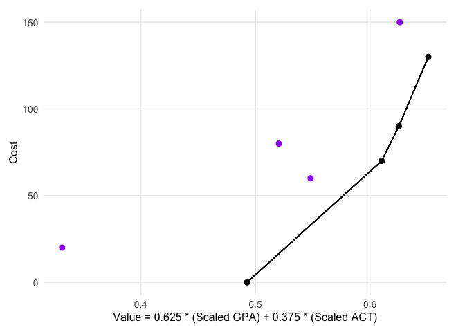

<!-- README.md is generated from README.Rmd. Please edit that file -->

# DAIVEtools

<!-- badges: start -->

<!-- badges: end -->

The goal of DAIVEtools is to support Decision Analysis for Intervention
Value Efficiency (DAIVE) by providing methods easily format data,
visualize results, and identify frontiers of efficiency for factorial
optimization trial data.

## Installation

You can install the development version of DAIVEtools from
[GitHub](https://github.com/) with:

``` r
# install.packages("pak")
pak::pak("setheaton/DAIVEtools")
```

## Example

This is a basic example which shows how DAIVEtools can format posterior
draws data into a table of expected value:

``` r
library(DAIVEtools)

## combine draws dataframes into a list object
draws <- list(gpaDraws, actDraws)

## define vectors of components and outcomes labels
components <- c("A", "B", "C")
outcomes <- c("GPA", "ACT")

## generate a frame with effects codes
codes <- DAIVEtools::get_codes(components)

## generate a value summary table
expectedValue <- DAIVEtools::values_table(draws, outcomes, components, codes)
expectedValue
#>    A  B  C   names        GPA GPA.scale      ACT ACT.scale
#> 1 -1 -1 -1 All Off -0.6798174 0.4997223 19.48335 0.4811386
#> 2  1 -1 -1       A  0.6116712 0.6514479 20.93811 0.5412324
#> 3 -1  1 -1       B -0.8555110 0.4790816 23.88989 0.6631660
#> 4  1  1 -1      AB -0.1651793 0.5601826 27.24404 0.8017211
#> 5 -1 -1  1       C -2.0651978 0.3369662 15.63841 0.3223100
#> 6  1 -1  1      AC  2.1327076 0.8301410 14.69324 0.2832665
#> 7 -1  1  1      BC -1.5802862 0.3939342 25.54174 0.7314017
#> 8  1  1  1     ABC  0.1622224 0.5986461 24.08650 0.6712878
```

Values tables can be used to easily combine outcomes with value
functions and identify frontiers of efficiency:

``` r
## define weights for outcomes
weights <- c(100/160, 60/160)

## calculate a value function as a weighted sum
expectedValue$valueFunc <- DAIVEtools::weight_outcomes(expectedValue,
                                                    c("GPA.scale", "ACT.scale"), 
                                                    weights)
expectedValue
#>    A  B  C   names        GPA GPA.scale      ACT ACT.scale valueFunc
#> 1 -1 -1 -1 All Off -0.6798174 0.4997223 19.48335 0.4811386 0.4927534
#> 2  1 -1 -1       A  0.6116712 0.6514479 20.93811 0.5412324 0.6101171
#> 3 -1  1 -1       B -0.8555110 0.4790816 23.88989 0.6631660 0.5481133
#> 4  1  1 -1      AB -0.1651793 0.5601826 27.24404 0.8017211 0.6507595
#> 5 -1 -1  1       C -2.0651978 0.3369662 15.63841 0.3223100 0.3314701
#> 6  1 -1  1      AC  2.1327076 0.8301410 14.69324 0.2832665 0.6250631
#> 7 -1  1  1      BC -1.5802862 0.3939342 25.54174 0.7314017 0.5204845
#> 8  1  1  1     ABC  0.1622224 0.5986461 24.08650 0.6712878 0.6258867

## calculate alternative costs using component costs
expectedValue$cost <- rowSums(expand.grid(A=c(0, 70), B=c(0, 60), C=c(0,20)))

## identify a frontier
DAIVEtools::frontier(expectedValue, "valueFunc", "cost")
#>     names cost valueFunc
#> 1 All Off    0 0.4927534
#> 2       A   70 0.6101171
#> 6      AC   90 0.6250631
#> 4      AB  130 0.6507595
```

Values tables can also be used to easily visualize frontiers of
efficiency:

``` r
DAIVEtools::DAIVE_plot(expectedValue, "valueFunc", "cost", 
                       outs=c("Scaled GPA", "Scaled ACT"), weights=weights, 
                       static=TRUE)
```


